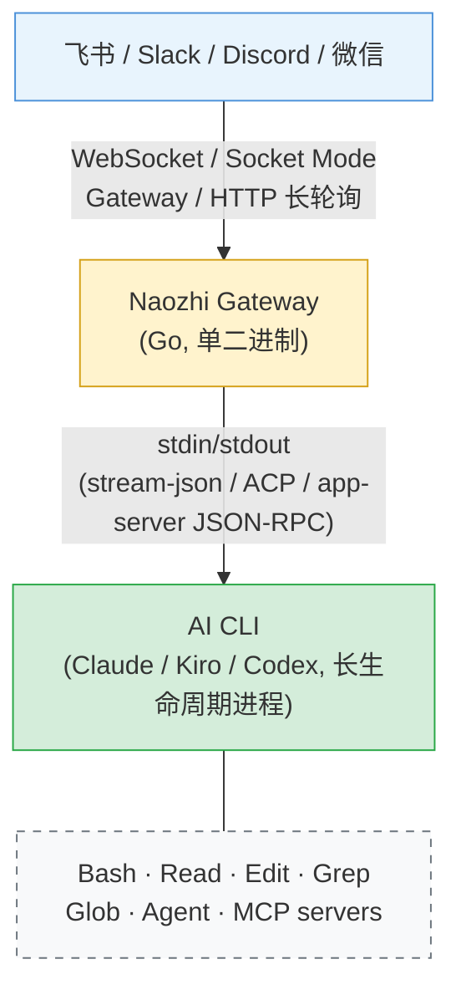
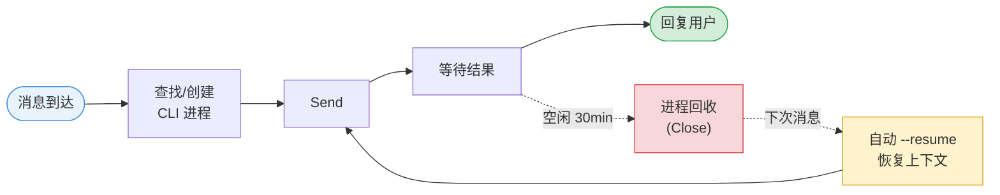
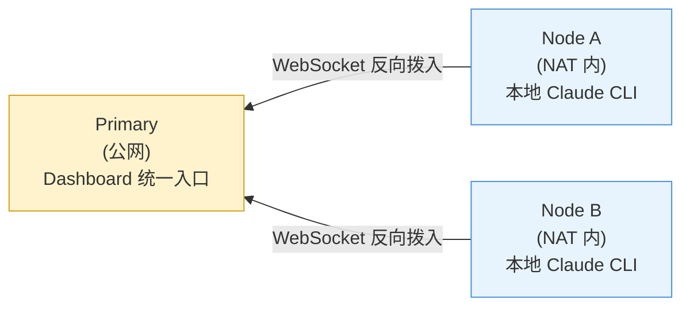

<div align="center">

# naozhi

**把 Claude Code 的完整 agent 能力装进你的聊天窗口**

在飞书 / Slack / Discord / 微信中直接使用 Claude Code —— 工具调用、代码编辑、MCP servers，一个都不少。

[快速开始](#快速开始) · [功能一览](#功能一览) · [Dashboard](#实时-dashboard) · [部署指南](#部署)

</div>

---

## 为什么选 Naozhi？

大多数 "AI 聊天机器人" 只是 API wrapper。Naozhi 不同 —— 它直接 spawn 本机 AI CLI（Claude Code、Kiro 或 Codex）作为长生命周期子进程，通过 stdin/stdout 进行原生协议通信，**保留 CLI 的全部能力**：

- 读写文件、执行 Bash、Git 操作、子 agent 编排
- 所有已配置的 MCP servers
- 自定义 system prompt 和 per-agent 模型选择
- 可插拔 Protocol：Claude `stream-json`（NDJSON）、Kiro `ACP`（JSON-RPC 2.0）或 Codex `app-server`（JSON-RPC 2.0）



### 核心优势

| | 特性 | 说明 |
|---|---|---|
| **0** | 零基础设施 | 所有平台均支持 WebSocket / 长轮询。无需公网 IP、域名或端口转发 |
| **1** | 完整 Agent 能力 | 不是 API wrapper，是真正的 Claude Code CLI —— 工具调用、代码编辑、MCP 一个不少 |
| **2** | 会话自动恢复 | 进程崩溃/回收后自动 `--resume`，对话上下文完整保留 |
| **3** | 单二进制部署 | Go 编译，无容器、无依赖。6 平台预编译 release，内置自动更新 |
| **4** | 实时 Dashboard | 浏览器实时查看所有会话、事件流、费用统计 |
| **5** | 多节点 NAT 穿越 | 远程机器反向拨入主节点，统一管理多台工作站 |
| **6** | 消息队列与抢占 | 忙时消息自动排队/合并，支持 `/stop` 软中断与 `/urgent` 紧急抢占 |
| **7** | 多 Backend | 同一实例可并存 Claude（stream-json）、Kiro（ACP）与 Codex（app-server），按会话切换 |

---

## 功能一览

### IM 平台接入

| 平台 | 接入方式 | 私聊 | 群聊 | 消息编辑 | 提问按钮 |
|------|----------|------|------|----------|----------|
| **飞书** | WebSocket 长连接 / Webhook | ✓ | ✓ | ✓ 流式更新 | ✓ |
| **Slack** | Socket Mode | ✓ | ✓ (mention) | ✓ 流式更新 | ✓ |
| **Discord** | Gateway WebSocket | ✓ | ✓ (mention) | ✓ 流式更新 | ✓ |
| **微信** | HTTP 长轮询 (iLink Bot) | ✓ | — | — | — |

「提问按钮」指 Claude 调用 AskUserQuestion 时把选项渲染成可点击的按钮；没有按钮的平台收到纯文本选项列表，直接回复文字作答。

所有平台开箱即用，**无需公网 IP**。

### 多 Agent 路由

一个群聊可同时使用多个专业 agent，各自保持独立上下文：

```
/review 帮我看看这段代码有没有安全问题    → code-reviewer agent (sonnet)
/research Rust async runtime 对比分析     → researcher agent (opus)
普通消息会路由到默认 agent                 → general agent
```

Agent 命令、模型、system prompt 均可在 `config.yaml` 中自定义。

### 会话生命周期



- **Watchdog 双超时**: 无输出超时 (默认 15min，工具运行时 Claude CLI 的 heartbeat 算作输出) + 总耗时超时 (默认 2h)，防止进程挂起
- **容量管理**: 可配置最大并发进程数 (默认 3)，满载时自动驱逐最久空闲会话
- **中断恢复**: 用户发送新消息时自动中断正在运行的 turn（软中断 control_request，ACP 回退 SIGINT）
- **会话自动串联**: 同一项目的会话通过**项目级稳定 session key** 精确接续，Dashboard "load earlier" 可跨 session 边界回溯（`session.project_stable_key`，默认开启）。早期基于 "同 workspace + 时间窗" 猜测的 `session.auto_chain` 已下线 —— 它会把主题无关的 one-off 会话误串成历史上下文，详见 [`docs/rfc/project-stable-session-key.md`](docs/rfc/project-stable-session-key.md)

### 消息队列与抢占

会话忙碌时，新消息的处理策略可配置（`session.queue.mode`）：

| 模式 | 行为 |
|------|------|
| `collect`（默认） | 排队等待当前 turn 完成，settle 延迟后合并为一条后续 prompt |
| `interrupt` | 每条新消息都自动打断当前 turn，最小化响应延迟（更费 token） |
| `passthrough` | 每条消息直接转发给 CLI，各自得到独立结果。需 stream-json 后端，ACP 自动回退到 collect |

- **`/stop`**: 软中断当前回复，保留后续排队消息
- **`/urgent <消息>`**: 紧急打断当前 turn 并优先处理该消息（passthrough 模式下的 `priority:"now"` 抢占）

### 多 Backend

同一个 naozhi 实例可同时挂载多个 CLI flavor：

```yaml
cli:
  backend: "claude"          # 默认 backend
  backends:
    - id: "claude"           # stream-json 协议
    - id: "kiro"             # ACP (JSON-RPC 2.0) 协议，自动选择
      path: "~/.local/bin/kiro-cli"
      model: "claude-sonnet-4.6"
    - id: "codex"            # codex app-server (JSON-RPC 2.0) 协议，自动选择
      path: "codex"
      model: "openai.gpt-5.5"  # 按 ~/.codex/config.toml 的 model_provider 取名（此为 amazon-bedrock）
      args: ["-c", "model_reasoning_effort=high"]
```

- Dashboard "new session" 下拉菜单按会话选择 backend
- API 通过 `/api/sessions/send {"backend": "kiro"}` 覆盖
- ACP backend 自动处理 `session/new`、`session/cancel` 通知与权限请求
- 每条 backend 的 `model`/`args` 省略时继承顶层 `cli.*`；`path` 不继承 `cli.path`，省略时按 id 自动查找（`~/.local/bin/<binary>`、常见安装目录、`$PATH`）；codex 必须自己设 `model` 和 `args`，否则会拿到 claude 的模型名与顶层 `cli.args`
- Codex 不接受 `effort` 字段（设了会告警并忽略），推理强度经 `args` 传：`-c model_reasoning_effort=<tier>`

### 定时任务 (Cron)

在聊天中直接管理定时任务：

```
/cron add "@every 30m" 检查 staging 环境的健康状态
/cron add "0 9 * * 1-5" /review 扫描最近的 open PRs
/cron add --keep-context "0 18 * * *" 接着昨天的进度写日报
/cron list
/cron pause <id>
/cron mode <id> fresh
```

- 标准 cron 表达式 + `@every` 语法
- 聊天里创建的任务默认每次执行都从新会话开始；加 `--keep-context` 则延续同一会话（`/cron list` 标 `[保留上下文]`）。两种任务在两次执行之间都不常驻 CLI 进程，保留上下文的任务下次执行时恢复同一会话
- 创建后可在创建该任务的会话发送 `/cron mode <id> fresh|keep` 切换，下次执行生效（正在执行的那次不受影响），连续失败计数清零
- 每 chat 10 个 / 全局 50 个配额
- 执行结果自动回推到聊天
- 连续失败 5 次自动暂停（`cron.auto_pause_after_failures` 可调；重启后收尾的孤儿云沙箱 run 不计，后端瞬时故障也不计，但同样次数的瞬时故障持续满 6 小时也会暂停），修复后在创建该任务的会话发送 `/cron resume <id>`，或在控制台恢复

### 语音转文字

发送语音消息即可与 Claude 对话。基于 Amazon Transcribe Streaming：

- 支持 OGG / FLAC / MP3 / WAV / M4A / AMR 等格式
- 不支持的格式自动通过 ffmpeg 转码为 PCM
- 多语言自动检测（可配置语言列表）
- 转码与上传并发执行，低延迟

### 项目规划器

将聊天绑定到代码项目，获得专属的 planner session：

```
/project my-app          → 绑定到 my-app 项目
普通消息自动路由到 planner → 长期上下文，不受 TTL 回收
/project off             → 解绑
```

- 自动发现 `projects_root` 下的子目录（跳过隐藏目录，无需 marker 文件）
- planner session 免驱逐、免 TTL，保持长期对话上下文
- 每个项目可配置独立的模型和 system prompt

### 实时 Dashboard

浏览器访问 `http://localhost:8180` 即可查看：

- 所有会话列表（运行中 / 就绪 / 挂起）+ 实时状态更新
- 事件流实时推送（thinking、tool_use、agent 调度、结果）
- 直接在 Dashboard 发送消息、上传文件（图片）、按会话选择 backend
- 会话级模型 / effort 切换：点击会话 header 的模型名或 effort 档位即可运行中切换（kiro 模型走 ACP `session/set_model`，claude 走 `set_model` control_request；effort 经优雅重启 + resume 生效，上下文保留），覆盖持久化、跨重启不弹回
- 发现并接管外部 Claude CLI 进程（一键 Take Over）
- 费用统计（per-session 累计 cost）
- 项目管理（绑定配置、planner 重启）
- 定时任务管理（顶级视图：创建、暂停、删除、run-now、调度预览）

### 多节点分布式

NAT 后面的工作站也能统一管理：



- 远程节点主动拨入 Primary 的 `/ws-node` WebSocket 端点
- Token 认证 + 自动重连（指数退避 1-30s）
- Dashboard 统一展示所有节点的会话
- 支持远程会话订阅、消息发送、进程接管

### 外部进程发现

自动扫描本机运行的 Claude CLI 进程：

- 扫描 `~/.claude/sessions/` 识别非 Naozhi 管理的 Claude 实例
- 显示会话概要（最后一条用户消息预览）
- 一键接管：SIGTERM → 等待 → `--resume` 接入 Naozhi 管理
- 自动首消息接管：检测到外部 session 时自动恢复

### System Session 后台守护

内置后台线程框架（`sysession`），用派生的 transient system session 执行周期性运维任务：

- **auto-titler**: 自动为活跃会话生成标题（达到最小轮次后触发，带重命名节流）
- **attachment-gc**: 回收超 TTL 且无引用的附件文件（默认 dry-run，先观察 would-remove 日志再开真删）

每个 daemon 独立 `enabled` 开关 + 调度周期，总开关为 `sysession.enabled`。

### 事件日志持久化

除 `sessions.json` 会话目录外，第二层持久化 `~/.naozhi/events/<keyhash>.log`/`.idx` 记录每一条事件 —— 包括 Claude 自身 JSONL 无法恢复的字段：图片缩略图、附件路径、AskQuestion 卡片、agent-team 关联 ID。配合附件引用计数（`.meta` sidecar 记录引用会话哈希 + 最后引用时间），支持基于双 TTL 的精确回收。

### 多语言 (i18n)（规划中）

中英双语（`zh-CN` / `en-US`）文案框架的纯逻辑内核已落地：按平台 locale 提示 + 消息内容 CJK 比例启发式解析语言（默认 `zh-CN`），用户锁定的语言不会被自动来源覆盖。运行时接线（catalog 加载、配置接入、dashboard 文案渲染）尚未完成，对应设计见 #631 的 follow-up slice，当前用户可见文案仍以中文为主。

### 自动更新

后台 goroutine 轮询 GitHub Releases，复用 `naozhi upgrade` 的校验流程（下载 → SHA-256 → 原子替换）：

- `notify` — 仅日志 + IM 通知
- `download`（默认）— 替换二进制，下次重启生效
- `auto` — 替换并立即重启

---

## 快速开始

### 前置条件

- [Claude Code CLI](https://claude.ai/code) 已安装并配置认证

### 安装

**推荐（macOS / Linux，零依赖）**：

```bash
curl -fsSL https://raw.githubusercontent.com/KevinZhao/naozhi/master/install.sh | bash
```

脚本会按当前 OS/架构从 [GitHub Releases](../../releases) 拉对应二进制、校验 SHA256、装到 `~/.local/bin/naozhi`，全程不用 sudo。支持固定版本：

```bash
curl -fsSL https://raw.githubusercontent.com/KevinZhao/naozhi/master/install.sh \
  | NAOZHI_VERSION=v0.0.3 bash
```

卸载：`curl -fsSL ... /install.sh | bash -s -- --uninstall`

升级：`naozhi upgrade`（下载 → SHA-256 校验 → 原子替换；也可在 `config.yaml` 开启后台自动更新）

**其它方式**：从 [Releases](../../releases) 手动下载，或源码编译：

```bash
go build -o bin/naozhi ./cmd/naozhi/
```

### 配置文件

仓库只提交 `config.example.yaml` 模板；部署时复制为 `config.yaml` 并填入你自己的值（`config.yaml` 在 `.gitignore` 中，避免提交环境特定数据）：

```bash
cp config.example.yaml config.yaml
# 编辑 config.yaml：填入 workspace 路径、IM 平台凭据、cron notify chat_id 等
```

凭据推荐通过环境变量注入（模板已用 `${VAR}` 占位），避免写死在文件中。

### 微信（两步启动）

```bash
# 1. 交互式扫码，自动获取 token 并生成配置
naozhi setup weixin

# 2. 启动
naozhi --config ~/.naozhi/config.yaml
```

扫码确认的微信用户（登录响应里的 `ilink_user_id`）会被写进
`im_access.platforms.weixin.allowed_users`，只有这个号发来的消息会被处理。其他微信号
发消息会在私聊里收到自己的 ID，加进 `allowed_users` 即可，见 [IM 访问控制](#im-访问控制)。

### 飞书

1. 飞书开放平台 → 创建企业自建应用 → 开启"机器人"能力
2. 权限: `im:message`, `im:message:send_as_bot`, `im:message:patch`
3. 事件订阅: 选择 "使用长连接接收事件"，订阅 `im.message.receive_v1`
4. 发布应用版本
5. 配置凭据并启动:
   ```bash
   export FEISHU_APP_ID=your_app_id
   export FEISHU_APP_SECRET=your_app_secret
   naozhi --config config.yaml
   ```

### Slack

1. [api.slack.com/apps](https://api.slack.com/apps) → Create New App
2. 开启 Socket Mode，获取 App-Level Token (`xapp-...`)
3. Bot Token Scopes: `chat:write`, `app_mentions:read`
4. Event Subscriptions: `message.im`, `app_mention`
5. Interactivity & Shortcuts → 开启（Socket Mode 下不需要填 Request URL）。不开启时 AskUserQuestion 的按钮点了没反应，但仍可直接回复文字作答

### Discord

1. [discord.com/developers](https://discord.com/developers/applications) → New Application → Bot
2. 开启 Message Content Intent
3. 获取 Bot Token，邀请到服务器
4. General Information 里的 Interactions Endpoint URL 留空：填了之后按钮点击改走 HTTP，不再经 Gateway 送达，AskUserQuestion 的按钮会点了没反应（仍可直接回复文字作答）

### 运行

```bash
naozhi --config config.yaml
```

健康检查: `curl http://localhost:8180/health`

Dashboard: 浏览器打开 `http://localhost:8180`

---

## 用户命令

| 命令 | 说明 |
|------|------|
| 普通消息 | 发送给默认 agent，保持多轮上下文 |
| `/review <text>` | 路由到 code-reviewer agent |
| `/research <text>` | 路由到 researcher agent |
| `/new` | 重置默认 agent 对话 |
| `/new review` | 重置指定 agent 对话 |
| `/clear` | 重置会话（同 `/new`） |
| `/stop` | 中断当前回复，保留后续排队消息 |
| `/urgent <text>` | 紧急打断并优先处理该消息 |
| `/cd <path>` | 切换工作目录 |
| `/pwd` | 显示当前工作目录 |
| `/project <name>` | 绑定到项目 |
| `/project off` | 解绑项目 |
| `/cron add [--keep-context] "<schedule>" <prompt>` | 创建定时任务（默认每次新会话） |
| `/cron list` | 查看定时任务 |
| `/cron del/pause/resume <id>` | 管理定时任务 |
| `/cron mode <id> fresh\|keep` | 切换定时任务是否每次从新会话开始 |
| `/help` | 显示可用命令 |

Agent 命令通过 `agent_commands` 配置映射，可自定义。

配置了 `im_access` 后，`/cd`、`/project`、`/cron` 只有 `admin_users` 能用（`admin_users` 为空时所有 `allowed_users` 都算管理员），见 [IM 访问控制](#im-访问控制)。

---

## 配置参考

```yaml
server:
  addr: ":8180"
  dashboard_token: "${DASHBOARD_TOKEN}"   # Dashboard 访问密码 (可选)
  trusted_proxy: false                    # ALB/CloudFront 终止 TLS 时设为 true

cli:
  backend: claude                         # "claude" | "kiro" | "codex"，单 backend 模式下的默认值
  path: "~/.local/bin/claude"
  model: "sonnet"                         # sonnet / opus / haiku
  args: []                                # claude 协议自己加 --dangerously-skip-permissions，写在这里只会被丢弃并告警

  # 可选：多 backend 并存（Claude / Kiro / Codex 同时启用）。dashboard "new session"
  # 下拉菜单可以按会话选 backend，API 端通过 /api/sessions/send {"backend": ...}
  # 覆盖。不设置 `backends` 时走单 backend 模式，使用上面的 cli.path/model/args；
  # 每条 backend 的 model/args 省略时从顶层 cli.* 继承，path 不继承 cli.path，
  # 省略时按 id 自动查找（~/.local/bin/<binary>、常见安装目录、$PATH）；`backend` 字段决定
  # 默认 backend（同时也作为 dashboard 下拉第一项）。完整注释示例见
  # config.example.yaml `cli.backends` 段。
  # backends:
  #   - id: claude
  #   - id: kiro
  #     path: "~/.local/bin/kiro"         # ACP 协议根据 id=kiro 自动选择，无需额外 flag
  #   - id: codex
  #     path: "codex"                     # codex app-server 协议根据 id=codex 自动选择
  #     model: "openai.gpt-5.5"           # 须显式设置，否则继承上面 claude 的 sonnet；args 也写明，免得继承顶层 cli.args
  #     args: ["-c", "model_reasoning_effort=high"]

session:
  cwd: "/home/user/projects"              # CLI 默认工作目录，亦作 /cd 的允许根路径
  max_procs: 3                            # 最大并发 CLI 进程
  ttl: "30m"                              # 空闲回收超时
  watchdog:
    no_output_timeout: "15m"              # 无输出超时；工具运行时 Claude CLI 每 30s 发 heartbeat，
                                          # 所以这里只拦模型长时间静默生成或 CLI 卡死
    total_timeout: "2h"                   # 单轮总超时
  store_path: "~/.naozhi/sessions.json"
  queue:                                  # 忙时消息策略
    mode: "collect"                       # collect | interrupt | passthrough
    max_depth: 20
    collect_delay: "500ms"
  # project_stable_key:                   # 项目级稳定 session key（默认开启）
  #   enabled: true
  # auto_chain 已在 schema v2 移除：没有 schema_version 的旧文件仍可加载，
  # 该块会报 deprecated 并被忽略；`naozhi config migrate` 会把它删掉。

agents:                                   # 自定义 agent
  code-reviewer:
    model: "sonnet"
    system_prompt: "You are a code reviewer..."  # 追加到 CLI 系统提示词
  researcher:
    model: "opus"

agent_commands:                           # 命令 → agent 映射
  review: code-reviewer
  research: researcher

cron:
  store_path: "~/.naozhi/cron_jobs.json"
  max_jobs: 50
  execution_timeout: "8h"
  timezone: "Asia/Shanghai"               # IANA 时区，解释 cron 表达式
  jitter_max: "2m"                        # 调度抖动上限，拍平并发峰值
  auto_pause_after_failures: 5            # 连续失败 N 次自动暂停；负数关闭

sysession:                                # 后台守护进程框架
  enabled: true
  daemons:
    auto-titler:                          # 自动会话标题
      enabled: true
    attachment-gc:                        # 附件回收（默认关闭 + dry-run）
      enabled: false
      dry_run: true

# update:                                 # 自动更新（轮询 GitHub Releases）
#   enabled: true
#   mode: "download"                      # notify | download | auto
#   interval: "6h"

transcribe:                               # 语音转文字 (Amazon Transcribe)
  enabled: true
  region: "us-east-1"
  language: "zh-CN,en-US"                 # BCP-47 列表，多语言自动检测

projects:
  root: "/home/user/projects"             # 项目扫描根目录

reverse_nodes:                            # 多节点：接受远程拨入
  my-workstation:
    token: "${NODE_TOKEN}"
    display_name: "Kevin's Mac"

im_access:                                # IM 发送者白名单，见「部署 · IM 访问控制」
  default_deny: false                     # true：没有条目的平台拒绝所有人
  # deny_reply: ""                        # 替换私聊里的拒绝文案（默认附带对方 ID）
  platforms:
    feishu:
      allowed_users: ["ou_xxxxxxxx"]      # 可以聊天；admin_users 也算
      admin_users: ["ou_yyyyyyyy"]        # 可以用 /cd /project /cron；空 = 所有人都是管理员

im_rate_limit:                            # 每个 IM 发送者的消息限流，见「部署 · IM 访问控制」
  msgs_per_min: 10                        # 0 或不配 = 不限
  burst: 3                                # 允许连发的条数；0 = 同 msgs_per_min

cost:
  budget:                                 # 每日费用预算（USD），见「部署 · IM 访问控制」
    per_chat_daily_usd: 20                # 每个 IM 会话；0 或不配 = 不限
    per_cron_job_daily_usd: 5             # 每个定时任务
    daily_usd: 100                        # 整台机器（dashboard 的花费也算）

# upstream:                               # 多节点：作为远程节点拨入
#   url: "wss://primary.example.com/ws-node"
#   node_id: "my-workstation"
#   token: "${NODE_TOKEN}"

platforms:
  feishu:
    app_id: "${FEISHU_APP_ID}"
    app_secret: "${FEISHU_APP_SECRET}"
    max_reply_length: 4000
  # slack:
  #   bot_token: "${SLACK_BOT_TOKEN}"
  #   app_token: "${SLACK_APP_TOKEN}"
  # discord:
  #   bot_token: "${DISCORD_BOT_TOKEN}"
  # weixin:
  #   token: "${WEIXIN_BOT_TOKEN}"
```

环境变量通过 `${VAR_NAME}` 语法自动展开。

---

## 部署

### 本地运行

所有平台均支持 WebSocket / 长轮询，直接运行即可，**无需公网 IP**。

### 服务器部署 (systemd)

```bash
# 编译
CGO_ENABLED=0 GOOS=linux GOARCH=arm64 go build -o bin/naozhi ./cmd/naozhi/

# 上传到服务器
scp bin/naozhi server:/usr/local/bin/

# 安装 systemd service（推荐 `sudo naozhi install`，自动生成单元文件；
# deploy/naozhi.service 是手动部署参考，与 cmd/naozhi/service.go 保持同步）
sudo cp deploy/naozhi.service /etc/systemd/system/
sudo systemctl daemon-reload && sudo systemctl enable naozhi

# 配置凭据
cat > ~/.naozhi/env << 'EOF'
FEISHU_APP_ID=your_app_id
FEISHU_APP_SECRET=your_app_secret
DASHBOARD_TOKEN=your_dashboard_password
EOF
chmod 600 ~/.naozhi/env

# 启动
sudo systemctl start naozhi
journalctl -u naozhi -f
```

> **可选 · 零停机重启 sudoers 精确化**：若希望 `systemctl restart naozhi` 时 shim
> 子进程不被 kill，参考 [`docs/ops/sudoers-hardening.md`](docs/ops/sudoers-hardening.md)
> 安装 `deploy/naozhi-sudoers.example`。不装也能跑 —— 只是每次 restart 会打断正在运行
> 的会话，journal 打 `WARN` 不致命。**切勿**为省事写 `NOPASSWD: ALL`。

> **在线 profile**：内存暴涨 / goroutine 泄漏 / CPU 热点排障，`ssh host` 后
> 用 `curl -H "Authorization: Bearer $TOK" http://127.0.0.1:8180/api/debug/pprof/...`
> 拉 heap / goroutine / CPU profile。端点受 token + **loopback-only** 双重防护，远端
> 请求（ALB / CloudFront）一律 403。详见 [`docs/ops/pprof.md`](docs/ops/pprof.md)。

> **一键排障**：`naozhi doctor` 聚合 binary / codesign / systemd / HTTP / auth /
> 服务端子系统 / 配置漂移 / pprof / 状态目录 / CLI backend / 语音转写 / 安全配置等检查，
> 任一 fail 退出码 1。CI 友好，支持 `--json` 输出。完整检查项见
> [`docs/ops/doctor.md`](docs/ops/doctor.md)。

### IM 访问控制

IM 消息会交给 CLI 执行，CLI 跳过权限确认（`--dangerously-skip-permissions`），
所以**能给 bot 发消息就等于能在宿主机上跑命令**。dashboard 和反向节点都有 token，
IM 入口靠的是 `im_access`：

```yaml
im_access:
  platforms:
    feishu:
      allowed_users: ["ou_alice", "ou_bob"]   # 飞书 open_id
      admin_users: ["ou_alice"]
    slack:
      allowed_users: ["U012ABCDEF"]           # Slack user ID
```

- **不配置 = 所有人都能用**（兼容旧配置）。启动日志、`naozhi config check`、
  `naozhi doctor` 会对每个没有条目的平台告警，`config check` 因此退出码为 1。
  `default_deny: true` 会拒绝所有没有条目的平台。
- `naozhi setup weixin` 会把扫码的微信用户写进 `im_access.platforms.weixin`。登录
  响应没给用户 ID 时，新建的配置文件写 `default_deny: true`（先发一条消息拿到自己的
  ID 再加进去）；已有的配置文件里不写 `default_deny`，免得把其他平台关在外面。已有的
  `im_access.platforms.weixin` 条目不会被改动。
- 平台一旦有条目，名单外的人和没有用户 ID 的消息都会被拒绝，包括飞书 / Slack /
  Discord 卡片上的 AskUserQuestion 按钮回答。被拒的消息不会触发任何命令，也不会进
  CLI。注意卡片在鉴权之前就会变成"已回答"：名单外的人、被限流或超预算的点击同样会让
  按钮消失，此时有权限的人请直接回复文字作答（与飞书一致）。飞书的语音和图片、Discord
  的图片附件在下载前就判定：名单外的人发来的语音不下载、不转写（不产生 Transcribe
  费用），图片不下载；群里的飞书语音因为没法 @bot 也不转写。
- **怎么拿用户 ID**：被拒的消息会在 Info 级别打一行 `im access denied`，`user`
  字段就是要填的 ID（飞书 open_id `ou_...`、Slack `U...`、Discord 用户 ID、微信
  `from`）。私聊里被拒的人也会收到带自己 ID 的提示，同一人 10 分钟最多一次；群里
  对名单外的人不回复，免得刷屏。拒绝次数记在 expvar `naozhi_dispatch_denied_total`。
- `/cd`、`/project`、`/cron` 只有 `admin_users` 能用；名单内的非管理员用这些命令
  时（私聊和群里都一样）会收到「该命令需要管理员权限。」。`admin_users` 为空时所有
  `allowed_users` 都算管理员，所以只开白名单不会少功能。
- 已有的定时任务不受影响：把某人移出名单后，他创建过的 cron 任务照常运行，要在
  dashboard 里手动删除。
- 改名单要重启 naozhi（会打断正在运行的会话），配置热重载见 #3437。
- 把自己关在外面时，dashboard 不受 `im_access` 影响，可以从那里继续操作。

`im_rate_limit` 限制每个发送者发消息的频率（令牌桶，按平台 + 用户 ID 分桶；平台没给
用户 ID 时按会话分桶），防止有人刷屏把账单打穿：

```yaml
im_rate_limit:
  msgs_per_min: 10   # 持续速率；0 或不配 = 不限
  burst: 3           # 可以连发的条数；0 = 同 msgs_per_min
```

- 斜杠命令也计数（`/cron add` 刷屏一样被挡），`/stop` 不计：它只会停下花费。
- 超限的消息直接丢弃，不进 CLI；发送者每分钟最多收到一次「消息过于频繁」提示。
  丢弃次数记在 expvar `naozhi_dispatch_rate_limited_total`。
- 在 `im_access` 之后检查，所以被拒的人不消耗额度；没 @bot 的群消息也不消耗。
- 管理员同样受限；改配置要重启 naozhi。

`cost.budget` 按 cost 账本限制每天的花费（USD），三档上限各自独立，0 或不配 = 不限：

```yaml
cost:
  budget:
    per_chat_daily_usd: 20       # 每个 IM 会话（同一会话的各个 agent 合计）
    per_cron_job_daily_usd: 5    # 每个定时任务
    daily_usd: 100               # 整台机器：IM、定时任务、dashboard、系统会话合计
    warn_ratio: 0.8              # 到这个比例时提醒；默认 0.8
    action: block                # block（默认）= 用尽后拒绝；warn = 只提醒不拒绝
    timezone: "Asia/Shanghai"    # 「一天」按这个时区的 0 点切换；默认同 cron.timezone
```

- **IM**：会话或整机的额度用尽后，新消息不进 CLI，会话每分钟最多收到一次「今日费用预算已
  用尽（$X / $Y），… 重置」。斜杠命令不受影响，`/stop`、`/new` 照常可用。被拒次数按
  scope 记在 expvar `naozhi_dispatch_budget_blocked_total`。绑定项目的会话走项目
  planner，同一项目的所有会话共用一份额度。管理员（`admin_users`）同样受限：名单为空时
  每个放行的用户都算管理员，豁免管理员等于让会话额度失效。
- **定时任务**：任务或整机的额度用尽后，到点的运行（包括手动「立即执行」）直接记为
  `skipped / budget_exceeded`，不启动会话、不计入自动暂停的连续失败次数；每个任务每天只有
  第一次跳过写进运行历史并通知会话，之后的跳过不再占历史条数。沙箱任务在 dashboard 上的
  「重放」也算一次新运行：额度用尽时返回 409、不启动 microVM，待处理条目留到重置后再重放。
- 到 `warn_ratio` 时，IM 回复末尾追加一行「⚠️ 今日费用已达预算的 80%」，定时任务发一条提示；
  每个 scope 每天各一次。整机额度的提醒每天只发给最先碰到它的那个会话或任务（额度用尽后的
  拒绝提示则每个会话、每个任务都会收到）。`action: warn` 时超过上限也照常执行，只再提醒一次。
- dashboard 不受预算限制（它是已登录的 owner），但它的花费计入整机额度。会话头部的运行统计
  和定时任务时间轴头部会显示「今日 $X / $Y」（取离上限最近的那一档，到 `warn_ratio` 加 ⚠，
  超过上限标红，悬停可看 scope 和重置时间）；数据来自 `GET /api/cost/budget?session_key=|job_id=`。
- 这是软上限：放行时还没超的那一轮可能把花费推过上限；花费在账本落盘后（约 1 秒内）才
  计入。只统计以 USD 计价的花费，按 credits / tokens 计量的 backend 不计入。
- 需要 cost 账本开着（`cost.enabled` 不能为 false）；改配置要重启 naozhi。

### 生产架构

```
CloudFront → ALB (SG: CloudFront-only) → EC2 :8180 → systemd
```

- ALB 安全组仅允许 CloudFront 前缀列表
- EC2 通过 IAM 角色认证 Bedrock（无 AKSK）
- 推荐 t4g.small ARM64 实例

### 发布

```bash
git tag v0.1.0
git push origin v0.1.0    # GitHub Actions 自动构建 6 平台二进制 + Release
```

---

## 项目结构

```
cmd/naozhi/              入口 + CLI 命令 (setup, install, doctor, upgrade, shim)
internal/
  cli/                   CLI 进程管理 + Protocol 接口 (stream-json / ACP)
  session/               Session 路由 + 并发控制 + TTL 回收 + 持久化
  dispatch/              消息处理 + slash 命令 + per-session 队列
  server/                HTTP server + REST API + WebSocket hub
  dashboard/             Dashboard 视图与资源
  platform/              IM 平台统一接口 (feishu / slack / discord / weixin)
  cron/                  定时任务调度器 (robfig/cron)
  project/ projectapi/   项目发现 + Planner 路由 + 项目 API
  sysession/             后台守护框架 (auto-titler / attachment-gc)
  discovery/             外部 Claude 进程扫描 + 接管
  transcribe/            语音转文字 (Amazon Transcribe Streaming)
  attachment/            附件存储 + 引用计数 GC
  eventlog/ history/     事件日志持久化 + 历史回放
  node/ upstream/        多节点协议 + 反向连接（WebSocket hub 在 server/ 内）
  selfupdate/            自动更新 (GitHub Releases 轮询 + 校验)
  shim/                  零停机重启 sidecar 进程
  i18n/                  多语言文案解析（纯逻辑内核，运行时未接线 · 规划中）
  metrics/ runtelemetry/ 指标 + 运行遥测
  config/                YAML 配置 + 环境变量展开
deploy/                  systemd service unit
```

## 设计文档

完整架构设计见 [DESIGN.md](docs/design/DESIGN.md)。

## License

[BSL 1.1](LICENSE) — 源码可读可改，个人和非生产用途免费。生产环境商用需获得授权。2030-03-21 后自动转为 Apache 2.0。
